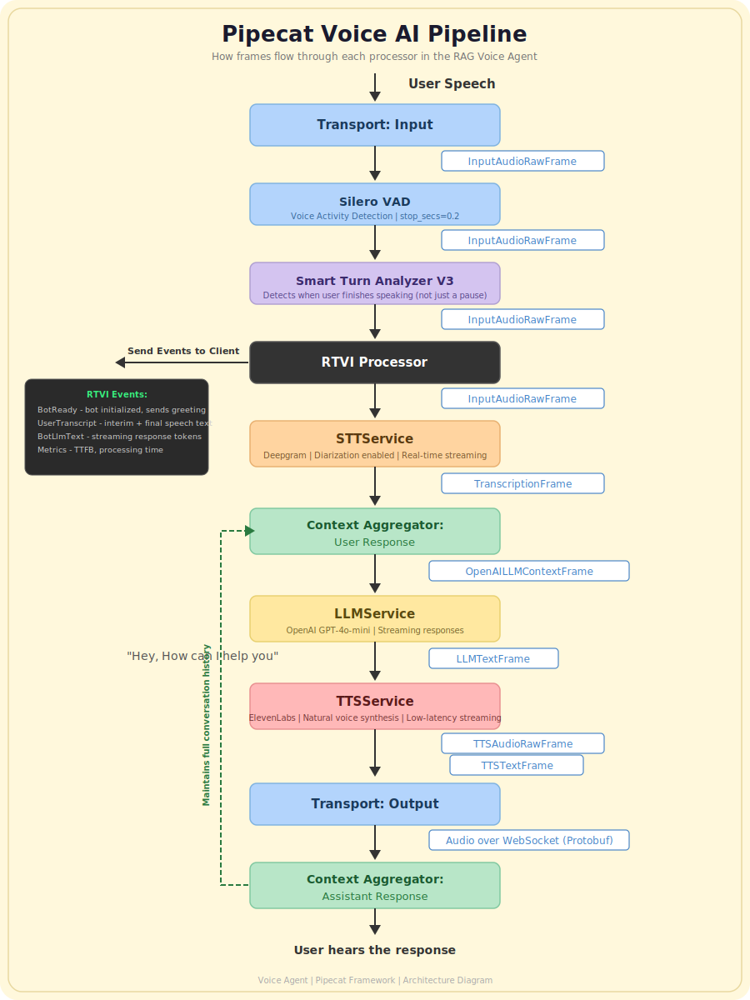
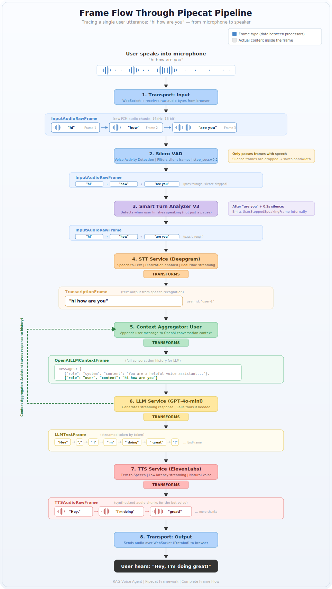
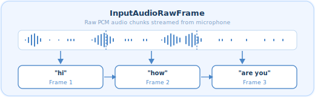

# RAG Voice Agent

A real-time voice-powered RAG (Retrieval-Augmented Generation) assistant built for industrial support workflows. Human call-center agents speak to an AI that retrieves answers from an equipment-specific knowledge base and responds with natural voice — all in real time over WebSocket.

https://github.com/user-attachments/assets/900deef5-d684-44f8-9781-a9492f51c21f

> **Demo:** A live conversation with the voice agent — the user asks a question, the system retrieves relevant documents, and the bot responds with a spoken answer in real time.
>
> *To add the demo video on GitHub: open an issue, drag `diagrams/rec.mov` into the comment box, copy the generated URL, and replace the placeholder link above.*

---

## Tech Stack

| Layer | Technology |
|-------|-----------|
| **Backend** | Python 3.13, FastAPI, Pipecat AI |
| **Frontend** | React 18, TypeScript, Vite, Tailwind CSS |
| **STT** | Deepgram (real-time streaming with diarization) |
| **LLM** | OpenAI GPT-4o-mini (streaming responses) |
| **TTS** | ElevenLabs (low-latency natural voice) |
| **VAD** | Silero (voice activity detection) |
| **Embeddings** | Google Gemini (`gemini-embedding-001`, 768d) |
| **Database** | MongoDB Atlas (documents + vector search) |
| **Infrastructure** | AWS ECS Fargate, ALB, ECR, CloudFormation |
| **Transport** | WebSocket with Pipecat RTVI protocol |

---

## Architecture

### Full-Stack Architecture

The system is split into a React frontend that handles voice capture and UI, and a FastAPI backend that orchestrates the Pipecat voice pipeline, RAG retrieval, and equipment management.


The frontend connects to the backend over WebSocket using the Pipecat RTVI transport. Audio frames flow bidirectionally — user speech goes in, bot speech comes out. REST endpoints handle equipment CRUD and document uploads.

---

### Backend Architecture

The backend is organized around FastAPI routers for equipment management and WebSocket streaming, with services for text extraction, embedding generation, and RAG retrieval from MongoDB Atlas Vector Search.


Key components:
- **Equipment Router** — CRUD for equipment records and document uploads (PDF/DOCX)
- **Stream Router** — WebSocket endpoint that spins up a per-session Pipecat pipeline
- **Embeddings Service** — Chunks documents with LangChain's `RecursiveCharacterTextSplitter` and embeds via Gemini
- **RAG Service** — Vector similarity search filtered by `equipment_id` and `tenant_id`
- **Bot** — Pipecat pipeline configuration wiring STT, LLM, TTS, and the `search_knowledge_base` tool

---

### AWS Infrastructure

The application is deployed on AWS using CloudFormation with ECS Fargate for container orchestration, an Application Load Balancer for routing, and ECR for Docker image storage.

.svg)

Infrastructure includes:
- VPC with public and private subnets across availability zones
- NAT Gateway for private ECS tasks to reach external APIs
- ALB with path-based routing to backend and frontend target groups
- ECS Fargate cluster running both services
- GitHub Actions CI/CD pipeline for automated deployments

---

### Pipecat Voice AI Pipeline

The voice pipeline is built on the Pipecat framework. Each processor in the pipeline receives frames, transforms or passes them through, and emits frames to the next stage.



Pipeline stages:
1. **Transport Input** — Receives raw audio bytes from the browser over WebSocket
2. **Silero VAD** — Filters out silent frames, only passing speech segments
3. **Smart Turn Analyzer** — Detects when the user has finished speaking (not just paused)
4. **RTVI Processor** — Sends real-time events to the client (transcriptions, bot status, metrics)
5. **Deepgram STT** — Converts speech audio to text with diarization
6. **Context Aggregator (User)** — Appends the user's transcribed message to the conversation context
7. **OpenAI LLM** — Generates a streaming response, calling `search_knowledge_base` tool when needed
8. **ElevenLabs TTS** — Synthesizes the LLM response into natural-sounding audio
9. **Transport Output** — Streams synthesized audio back to the browser over WebSocket
10. **Context Aggregator (Assistant)** — Saves the bot's response to conversation history for context continuity

---

### Frame Flow (Detailed Trace)

This diagram traces a single user utterance — *"hi how are you"* — through every stage of the pipeline, showing the exact frame types and data transformations at each step.



The flow illustrates how raw PCM audio is chunked into `InputAudioRawFrame`s, transformed into a `TranscriptionFrame` by Deepgram, assembled into an `OpenAILLMContextFrame`, processed by the LLM into streamed `LLMTextFrame` tokens, synthesized into `TTSAudioRawFrame` chunks by ElevenLabs, and finally sent back to the user as audio over WebSocket.

---

### InputAudioRawFrame

A closer look at how raw microphone audio is split into discrete frames for streaming through the pipeline.



Continuous PCM audio (16kHz, 16-bit) from the user's microphone is divided into sequential frames, each containing a small chunk of audio data. These frames flow independently through the pipeline, enabling real-time streaming with minimal latency.

---

## Project Structure

```
RagVoiceAgent/
├── Backend/
│   ├── main.py                    # FastAPI entry point
│   ├── app/
│   │   ├── bot.py                 # Pipecat pipeline configuration
│   │   ├── config.py              # Settings (env-based)
│   │   ├── database.py            # MongoDB connection
│   │   ├── models/
│   │   │   ├── document.py        # Document & chunk schemas
│   │   │   ├── equipment.py       # Equipment schemas
│   │   │   └── rag.py             # RAG query/response models
│   │   ├── routers/
│   │   │   ├── equipment.py       # Equipment + document upload API
│   │   │   └── stream.py          # WebSocket voice streaming
│   │   └── services/
│   │       ├── embeddings.py      # Text chunking + Gemini embeddings
│   │       ├── rag.py             # Vector search retrieval
│   │       └── text_extraction.py # PDF/DOCX text extraction
│   ├── Dockerfile
│   └── pyproject.toml
├── Frontend/
│   ├── src/
│   │   ├── App.tsx                # App shell with routing
│   │   ├── pages/
│   │   │   └── Stream.tsx         # Voice conversation page
│   │   ├── components/
│   │   │   ├── RealTimeChatPanel.tsx
│   │   │   ├── BotMessageBubble.tsx
│   │   │   ├── UserMessageBubble.tsx
│   │   │   └── AnimatedBackground.tsx
│   │   ├── hooks/                 # Custom React hooks
│   │   ├── types/                 # TypeScript type definitions
│   │   └── utils/                 # Utility functions
│   ├── Dockerfile
│   └── package.json
├── Infrastructure/
│   ├── cloudformation.yaml        # Full AWS stack definition
│   ├── setup-aws.sh               # Deploy CloudFormation stack
│   └── destroy-aws.sh             # Tear down AWS resources
├── scripts/
│   ├── create-services.sh         # Create ECS services
│   ├── build-and-push-ecr.sh      # Build & push Docker images
│   └── deploy_aws.sh              # End-to-end deployment
├── diagrams/                      # Architecture diagrams
├── docker-compose.yml             # Local development setup
└── .github/workflows/
    └── deploy.yml                 # CI/CD pipeline
```

---

## Getting Started

### Prerequisites

- Python 3.13+
- Node.js 18+
- MongoDB Atlas cluster with vector search index
- API keys: Deepgram, OpenAI, ElevenLabs, Google Gemini

### Local Development

1. **Clone the repository**

```bash
git clone https://github.com/your-username/RagVoiceAgent.git
cd RagVoiceAgent
```

2. **Backend**

```bash
cd Backend
cp .env.example .env  # Fill in your API keys
uv sync
uv run uvicorn main:app --reload --port 8000
```

3. **Frontend**

```bash
cd Frontend
npm install
npm run dev
```

4. **Or use Docker Compose**

```bash
docker compose up
```

The frontend will be available at `http://localhost:3000` and the backend at `http://localhost:8000`.

### Deploying to AWS

```bash
cd Infrastructure
./setup-aws.sh          # Deploy CloudFormation stack

cd ../scripts
./create-services.sh    # Create ECS services
./build-and-push-ecr.sh # Build and push Docker images
```

Subsequent deployments are handled automatically by the GitHub Actions workflow on push to `main`.

---

## Key Features

- **Real-time voice conversation** over WebSocket with sub-second latency
- **Equipment-aware RAG** — upload documents per equipment, vector search filtered by equipment and tenant
- **Document ingestion** — PDF and DOCX extraction, recursive chunking, and Gemini embedding
- **Streaming end-to-end** — STT, LLM, and TTS all stream for minimal time-to-first-byte
- **Live transcription** — user and bot transcripts displayed in real time in the UI
- **Production-ready deployment** — Dockerized services on AWS ECS Fargate with CI/CD
